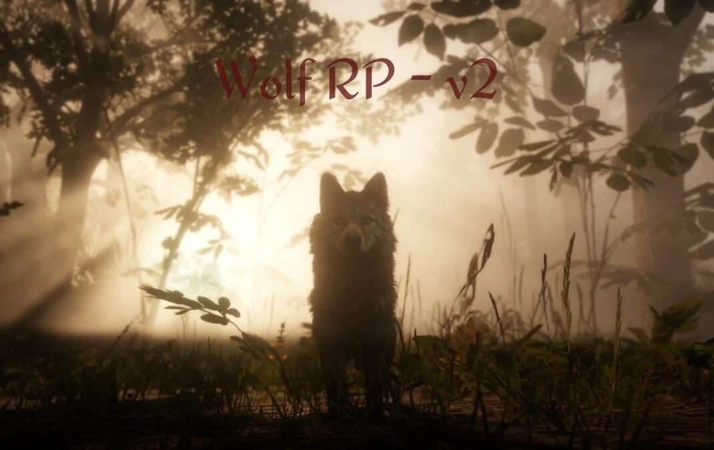

# **PROJET BOT RP RED DEAD REDEMPTION** 

## **Présentation du projet**

Le projet consiste à développer un bot Discord dédié au rôle-play de Red Dead Redemption (RDR). Ce bot utilise JavaScript et permet d'ajouter plusieurs fonctionnalités pour enrichir l'expérience RP au sein des serveurs. L'objectif est de créer un bot complet, interactif et facilement utilisable pour la gestion des sessions RP, des rôles et bien plus encore.

## **Fonctionnalités actuelles**

Le bot est déjà opérationnel avec les fonctionnalités suivantes :

- **Gestion des Rôles :** 
  Attribution et gestion des rôles pour les joueurs en fonction de leurs actions ou de leur progression dans le RP.

- **Message de lancement et de clôture du serveur RP :** 
  Envoi de messages automatiques lors du lancement et de la clôture des sessions RP, avec un compte à rebours en direct.

- **Message d'information pour prévenir les futures sessions RP :** 
  Un message d'information détaillant la date et l'heure de la prochaine session RP, afin de prévenir les joueurs à l'avance.

- **Message de pré-lancement :** 
  Envoi d'un message quelques minutes avant le début de la session RP, avec les consignes à respecter pour bien débuter la session.

## **Fonctionnalités à venir**

Le projet évolue constamment, et de nouvelles fonctionnalités sont en cours de développement, telles que :

- **Gestion de la banque :** 
  Intégration d'une fonctionnalité pour gérer les finances des joueurs dans le RP.

- **Gestion des objets et équipements :** 
  Permettre aux joueurs de gérer leurs objets et équipements dans le cadre du RP.

## **Objectif du projet**

L'objectif principal est de créer le bot RP Red Dead Redemption le plus complet et fonctionnel possible. Une fois stable, il sera mis à disposition des autres serveurs Discord qui souhaitent enrichir leur expérience RP avec des outils automatisés.

## **Conclusion**

Ce projet a pour but de rendre les sessions RP plus immersives et organisées, tout en apportant une gestion plus fluide des éléments clés du jeu. N'hésitez pas à rejoindre le projet et à contribuer pour faire de ce bot l'outil ultime pour tous les serveurs RP Red Dead Redemption !

## **Dernère mise à jour effectuée 17.12.2024**

automatisation d'un lien cliquable toutes les 2h de 08h à 22h pour pouvoir voter pour notre serveur dans un salon spécifique.

Précédente Mise à jour : WOLF RP V2.1.5 (17.12.2024)
Mise à jour            : WOLF RP V2.2   (17.12.2024)

